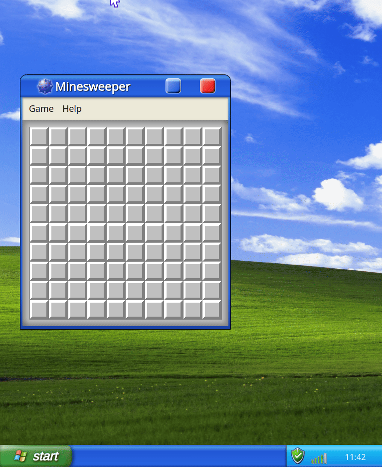

<h1>Hi I'm Alexandra</h1>

I build fun stuff

 
  

    <h4>flood game</h4>
- also an ai project to solve it -

    

      
    

  

  

        <h4>recursive backgtracing</h4>
        
a small project to render the workings of recursive backtracking in maze creation 

        

          
        

      

    

        <h4>LAVTech Quick Pick</h4>
        
a small (windows) project to herd files to usb

        

          
        

      

  

    <h4>xpwindow</h4> 
A web design offering a glimpse throught the window into early 2000's best operating system. Along with my favourite, Minesweeper

    

      
    

  

        

